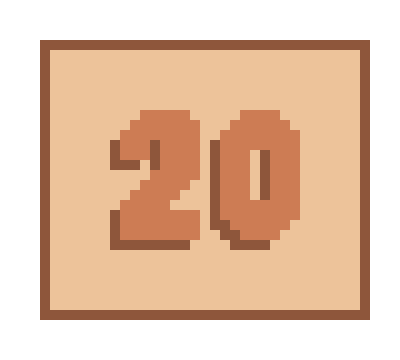

<p align=center>
  
  <p align="center">20-20-20 rule enforcer for compositors implementing ext-session-lock.<p>
</p>

# Twenty

Twenty makes sure that you look 20 ft away every 20 minutes for 20 seconds to relax your eyes.

Uses [waycrate/exwlshelleventloop/iced_sessionlock](https://github.com/waycrate/exwlshelleventloop/tree/master/iced_sessionlock)
for locking the screen.

### Installation

```
cargo install twenty
```

### Usage

Twenty runs as a daemon in the background. Sends a notification 10 seconds before locking the screen.

Initiaizing:

```
twenty --init [light/dark]
```

Killing:

```
twenty --kill
```

Pausing:

```
twenty --pause
```

View status (running / paused / not running):

```
twenty --status
```

### Configuration

You can configure twenty by creating a file in `~/.config/twenty/config.toml`.

Example config:

```toml
theme = "dark"
cooldown = "20m"
lock_timer = "20s"
blacklisted = ["steam", "mpv"]
```

- `theme`: theme of the locked screen, can either be `light` or `dark`.
- `cooldown`: duration between successive locks.
- `lock_timer`: duration of locking the screen.
- `blacklisted`: twenty checks if these processes are running and prevents locking the screen.

#### Authored by [rv178](https://github.com/rv178) and [shivkr6](https://github.com/shivkr6)
